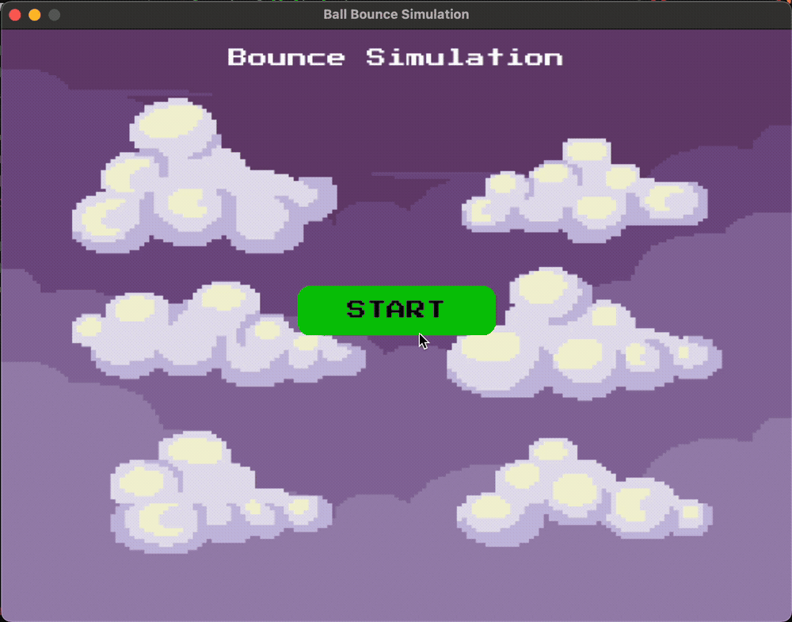

# Bouncing Ball Simulation with pygame

This script is a simple interactive bouncing balls simulation built with Python and Pygame. The program demonstrates basic physics, animation, and user interface elements like buttons and custom fonts.

## Features
- Five colorful balls bouncing around the window with gravity and realistic bouncing behavior.
- A pixel-style title rendered using a custom font (`PressStart2P.ttf`).
- **Start** button to begin the simulation.
- **Restart** button appears after the simulation ends, allowing you to restart the bounce.
- Rounded buttons with centered text for a polished UI.
- Background image support with automatic scaling to fit the window.


## How To Run
1. **Install Pygame if you haven't yet:**
```bash
python3 -m pip install pygame
```

2. **Place these files in the same directory:**
- `background.jpg` (your background image)
- `ball.png` (the ball sprite)
- `PressStart2P.ttf` (pixel font file, can be downloaded from [Google Fonts](https://fonts.google.com/specimen/Press+Start+2P))
- `bounce.py` (your python script with the bounce simulation code)

3. **Run the script**:
```bash
python3 bounce.py
```

## How It Works
- At launch, the **Start** button appears on the screen.
- Clicking **Start** launches the simulation where five balls bounce around with gravity and realistic collisions.
- When all balls come to rest (stop bouncing), the simulation ends and the **Restart** button appears.
- Clicking **Restart** resets the balls and starts the simulation again.
- The background fills the window and the pixel-font title is displayed at the top.

## Dependencies
- Python 3.x
- Pygame

## Acknowledgments

- [Pygame](https://www.pygame.org/news) for the game framework.
- [Press Start 2P Font](https://fonts.google.com/specimen/Press+Start+2P) for the pixel font.
